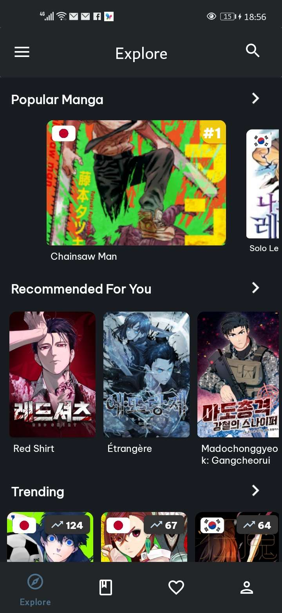
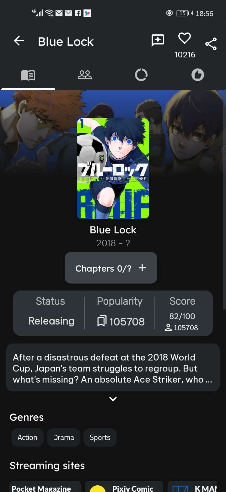
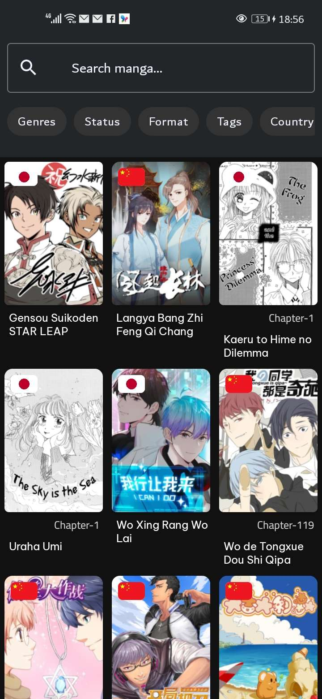

# Tanuki 🦝

<div align="center">
  <a href="https://github.com/raslenabb12/Tanuki">
    
  </a>
</div>


**Tanuki** is a comprehensive, feature-rich Android application designed for manga and anime enthusiasts. Built with modern Android development practices in Kotlin, Tanuki provides a seamless experience for tracking, discovering, and exploring manga and anime using the **AniList API**. It also offers syncing capabilities with **MyAnimeList (MAL)**.

## ✨ Features

- **AniList Integration**: Fully powered by the AniList API with seamless OAuth authentication.
- **MyAnimeList Sync**: Sync your library and progress between AniList and MyAnimeList.
- **Discover & Explore**: Browse trending, popular, and recommended manga effortlessly.
- **Advanced Search**: Search for specific manga, characters, and even other users.
- **Detailed Information**: View comprehensive details about any manga or anime, including character lists, user reviews, and related media.
- **Library Management**: Keep track of your reading progress, organize your favorites, and manage your library.
- **User Profiles & Stats**: View user profiles, follow other users, check your followers/following, and visualize your reading statistics with beautiful charts.
- **Reviews & Forums**: Read full user reviews and dive into manga discussions.
- **Home Screen Widgets**: Quick access to your tracking lists via beautiful Android widgets.
- **Modern UI/UX**: Features a slick, responsive user interface utilizing Material Components, Shimmer loading effects, full-screen bottom sheets, and zoomable images.

## 🛠️ Tech Stack & Architecture

Tanuki is built using the latest Android development standards:

- **Language**: Kotlin
- **Architecture**: MVVM (Model-View-ViewModel)
- **Networking**: Retrofit, OkHttp, Moshi, and Gson for robust REST API communication.
- **Local Database**: Room for offline caching and local data persistence.
- **Asynchronous Operations**: Kotlin Coroutines and Flow/LiveData.
- **Pagination**: Paging 3 library for infinite scrolling and efficient data loading.
- **Image Loading**: Glide for fast image loading and caching, with `subsampling-scale-image-view` for high-resolution image zooming.
- **UI Components**: 
  - Material Design Components
  - Shimmer for Android (Facebook) for loading skeleton screens
  - SwipeRefreshLayout
- **Data Visualization**: MPAndroidChart for detailed reading statistics.
- **Media**: Android YouTube Player integration for trailer playback.
- **HTML Parsing**: Jsoup for scraping/parsing specific web data when API endpoints are insufficient.
- **Security**: AndroidX Security Crypto for secure storage of OAuth tokens.

## 📱 Screenshots

||||
|:---:|:---:|:---:|
| **Discover** | **Manga Info** | **Search** |

## 🚀 Getting Started

### Prerequisites

- Android Studio (Latest version recommended)
- Minimum SDK: API 28 (Android 9.0)
- Target SDK: API 34 (Android 14)

### Installation

1. **Clone the repository:**
   ```bash
   git clone https://github.com/yourusername/tanuki.git
   ```
2. **Open the project in Android Studio:**
   - Select `File > Open` and choose the cloned `tanuki` directory.
3. **Build and Run:**
   - Sync the Gradle files.
   - Select your target device or emulator and click the "Run" button.

## 🤝 Contributing

Contributions, issues, and feature requests are welcome! 
Feel free to check the [issues page](https://github.com/yourusername/tanuki/issues) if you want to contribute.

## 📝 License

This project is open-source. Please include a `LICENSE` file (e.g., MIT, Apache 2.0) to specify how others can use your code.

---
*Built with ❤️ for Manga Readers.*
